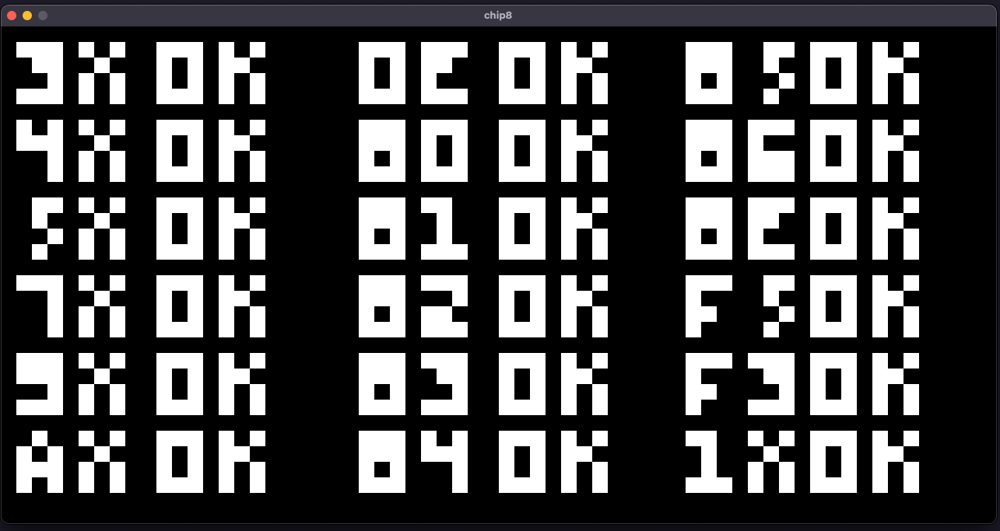

# Chip8-emu
This is a chip8 emulator written using Rust and SDL2. 

## Results (Will probably add more shots)

## Resources
* [Cowgod's Chip8 technical specification](http://devernay.free.fr/hacks/chip8/C8TECH10.HTM#Fx85)
* [Tobias' guide to making a chip8 emulator](https://tobiasvl.github.io/blog/write-a-chip-8-emulator/)
* [Chip8 opcode test rom](https://github.com/corax89/chip8-test-rom)
